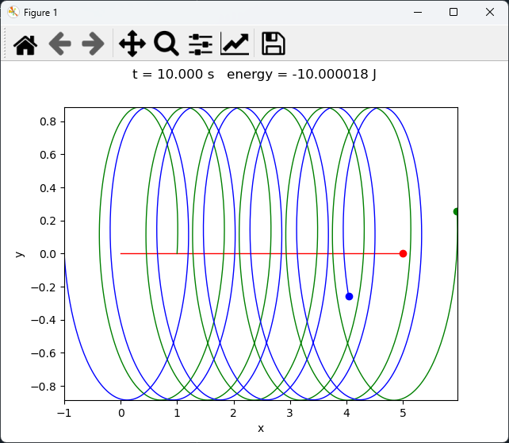
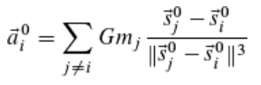
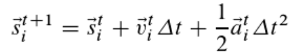
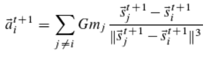
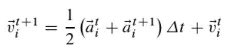
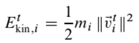
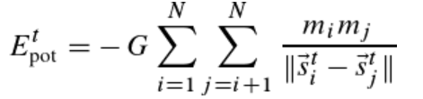
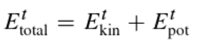

# Information

- This project computes the positions, velocities, and accelerations of three bodies interacting through Newtonian gravity.  
- The **Velocity–Verlet** integration method is used for stable and accurate time evolution.  
- After the simulation, the trajectories of the bodies are animated, including their motion trails.

---

# Run

- Execute the file `three_body_sim.py`.  
- After the simulation finishes, an animation showing the motion of all bodies will appear.

---

# Results

The following image shows an example result of the simulation:

# Process of Computation

## Nomenclature

- \( i, j \): indices for the bodies  
- \( t \): current time step  
- \( t+1 \): next time step  

---

## 1. Dynamics

### 1.1 Initial Time Step

- The initial positions and velocities are given.  
- The accelerations are computed using Newton’s law of gravitation.

**Acceleration formula**

---

### 1.2 Subsequent Time Steps

- Using the current acceleration, compute the new positions at time \( t+1 \).  
- The **Velocity–Verlet** method is used for time integration.

**New position**

- After updating the positions, compute the new accelerations.

- Finally, compute the new velocities at time \( t+1 \).

---

## 2. Energies

For every time step, the total energy of the system can be computed.

### 2.1 Kinetic Energy

Each body contributes a kinetic energy term:

### 2.2 Potential Energy

Each pair of bodies contributes a gravitational potential energy term:

### 2.3 Total Energy

The total energy is the sum of kinetic and potential energy:

